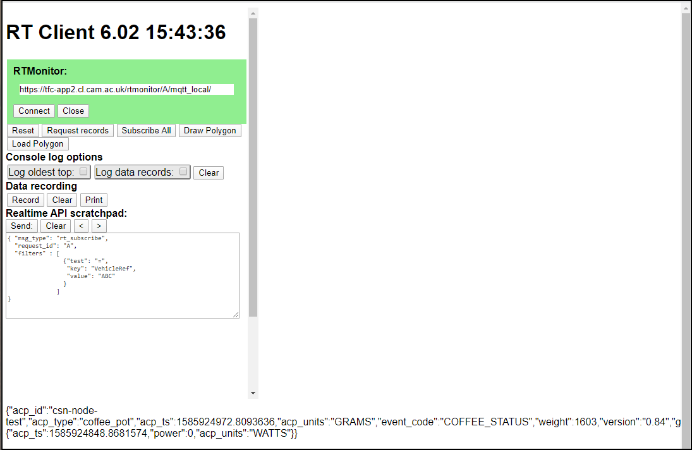

# RT Client

Demo html/js websocket client for RTMonitor

The idea is to provide a 'template' web page / javascript package that can be used to develop
web pages with real-time websocket connections back to RTMonitor. Initially this skeleton web
page should be used with the browser 'dev' console open as informative messages will be seen
there.

Before using this skeleton, have a good look at the RTMonitor documentation.

1. Connect to the RTMonitor with the 'Connect' button. The area around the RTMonitor URL should
turn green.

2. Click the 'Request records' button for a "rt_request" message to be sent on the websocket and
the latest data record from the feed will be returned.

3. Click the 'Subscribe All' button for a "rt_subscribe" message to be sent on the websocket - any
new data messages will be sent to this browser client.

4. Incoming messages can be seen in the div across the lower portion of the page.

5. The large area of the page left blank is intended to house the user-developed code that
uses the RTMonitor subscription capability. When complete, the logging and user debug features
on this skeleton page can be removed.

An example of the use of rtclient is in the [Cambridge Coffee Pot](https://github.com/ijl20/cambridge_coffee_pot/tree/master/code/web) web page.
